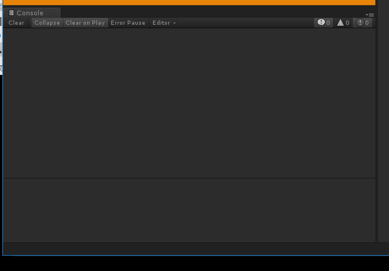

<!-- $theme: gaia -->

# Unity入学式 第1回
## インストールしてみよう！

---

## 本日の内容
- Unityのインストール
- Unity入学式の説明
- Unityの画面説明
- Startシーンの作成

---

# Unityのインストール

---

## Unityのインストール
- まずはダウンロード
- https://store.unity.com/ja
- Personalを選択

---

## Unityのインストール
- 条件を確認してダウンロード

---

## Unityのインストール
- Nextを選択

---

## Unityのインストール
- Nextを選択

---

## Unityのインストール
- Nextを選択
- UnityとVisualStudio（MacだとVisualStudioCode）にチェックが入っているか確認

---

## Unityのインストール
- Finish

---

## Unityのインストール
- Nextを選択

---

## Unityのインストール
- 起動！

---

## Unityのインストール
- 起動後

---

# Unity入学式の説明

---

## Unity入学式の説明
- 毎月1回ずつ全部で4回か5回やります
- 2Dのゲーム(ユニティちゃんの2Dアクションゲーム)を作りながらUnityの基本的な仕組みを学びます
- 質問があれば適宜手を挙げて質問してください
- もしくは周りにいるスタッフに質問してください
- Okinawa.unityのSlackがあるのでそちらで質問するのもOKです

---

## Slack

---

## 自習のススメ
- 1ヶ月に1回だけ勉強しても忘れがち
- 週に1回でもいいのでUnityを触ると忘れない

---

## おすすめ本
- 自分が気に入った本であればなんでもいい
- 100%理解できなくてもいいから本の中身を1回全部やる
- 終わったらもう1度やると前回より理解できる
- これから紹介する本は作りながら学ぶ（説明だけの箇所が少ない）ので飽きにくい

---

## おすすめ本
- 10日で学ぶUnity 5　2Dゲーム入門　カジュアルゲーム制作で楽しく覚えよう！
- 著者：株式会社フーモア Unity部
- ¥2,592

---

## おすすめ本
- 作って学ぶ　Unityゲーム開発の教科書　【Unity 5対応】
- 著者：森 信虎、さいたまげーむす
- ¥3,229

---

## もくもく会
- みんなで集まって各自もくもく勉強する会
- あちこちで開催されている
- スタートアップカフェコザ
	- 毎月第1日曜日にUnityもくもく会開催中

- 希望があればもくもく会も開催します

---

## LT大会
- 1人5分くらいの短い時間でプレゼンする（ライトニングトーク, LT）勉強会
- 勉強した事をLT大会で発表する
- Okinawa.unityでもLT大会やりました
	- 希望があればちょいちょいやります 
- 宜野湾エンジニア勉強会
	- 毎月LT大会を行っている

---

## 電源・Wifi付きカフェ(コワーキングスペース)
- スタートアップカフェコザ（沖縄市）（無料！）
- CODE BASE （宜野湾市）（無料！※平日のみ）
- スターバックス
- その他いろいろ

---

# Unityの画面説明

---

## Unityの起動後
- Newを押す

---
## 新規プロジェクト作成
- ProjectName:UnityEntrance
- Template:2D
- Location:どこかにUnityEntranceというフォルダを作ってそれを選択する
- Create projectを押す

---

## 新規プロジェクト作成
- こんな画面が出るはず

---

## おすすめレイアウト
- 左から
	- Hierarchy
	- Inspector
	- Project 

---

## おすすめレイアウト
- One Column Layout

---

## おすすめレイアウト
- Consoleを左下に

---

## ユニティちゃんの2Dゲームのダウンロード
- http://unity-chan.com/
- 右上のDATA DOWNLOAD

---

## ユニティちゃんライセンス(抜粋)
- クリエイターができること
	- 弊社：ユニティ・テクノロジーズ・ジャパン合同会社
	- 弊社キャラクターの二次創作物をつくること
	- 弊社キャラクターの二次創作物を、作成したクリエイター自身が公開したり、頒布すること。
	- その際、頒布を受けるユーザーにも本ライセンスを継承させる旨を、UCLロゴもしくはライセンス表記のいずれかの表示をもって宣言すること。

---

## ユニティちゃんライセンス(抜粋)
- クリエイターができないこと
	-  他の人が作った作品を、自分のものと偽って公開・頒布したり、他の人が権利を有している作品やキャラクターを、権利を持っている人の許可を受けることなしに使用すること
	- 弊社および弊社キャラクターの価値や品位を下げるような使い方をすること
---

## ユニティちゃんライセンス(抜粋)
- クリエイターができないこと
	- 他の人を不快にさせたり、または他の人を差別したり、傷つける目的で弊社キャラクターを使うこと。特定の信条や宗教、政治的発言のために、弊社キャラクターを使用すること
	- 他別途弊社からの許可を受けることなしに、弊社のオフィシャル商品であると誤認されるような使い方をすること

---

## ユニティちゃんの2Dゲームのダウンロード
- ライセンスに同意しましたにチェックを入れる
- データをダウンロードする

---

## ユニティちゃんの2Dゲームのダウンロード
- 2Dを選択

---

## ユニティちゃんの2Dゲームのダウンロード
- 「ユニティちゃん 2Dデータ」をダウンロード

---

## ユニティちゃんの2Dゲームのインポート
- UnityChan2D.unitypackageをProjectにドラッグアンドドロップ
- Importを押す

---

## ユニティちゃんの2Dゲームのインポート
- 2Dゲームが公開されたのがちょっと前なので警告が表示される
- 「古い機能が使われているので自動で新しい機能に置き換えますよ」
- Go Ahead!を押す

---

## Startシーンを開く
- Startをダブルクリック

---

## Sceneタブ
- 現在開かれているシーンの内容を表示する
- マウスホイール：拡大縮小
- 右クリックしながら動かす：表示位置を動かす
- Unityではゲームの場面をシーンという単位で管理する
	- 画面 = シーンという理解でだいたいあっている 

---

## Hierarchyタブ
- シーンに置かれたオブジェクトの一覧を表示する
- オブジェクトを選択するとSceneタブでも同じものが選択される

---

## Inspectorタブ
- Hierarchyタブで選択されたオブジェクトの詳細を表示する

---

## Projectタブ
- ゲーム全体をProjectという単位で管理する
- プロジェクト内のファイル（画像やソースコードなど）を全て表示している

---

## Gameタブ
- 実際のゲーム画面を表示する

---

## 再生ボタン
- 左から、再生、一時停止、停止
- 再生ボタンを押すと現在開いているシーンからゲームが開始される

---
## 手のマーク、十字矢印マーク
- 一番左の手のマーク：Hand Tool
	- Sceneタブの画面を移動させる 
- 左から2番めの十字矢印マーク：Move Tool
	- 選択したオブジェクトの位置を移動する

---

# Sratシーンの作成

---
## シーン名の変更
- Assets -> UnityChan2D -> Scenesにある「Introduction_Demo」の名前を「Start」にする
- Startをダブルクリックして開く

---

## 背景の作成
- Hierarchyタブで右クリック-> CreateEmpty

---

## 背景の作成
- 作成された「GameObject」の名前を「Backgrounds」に変更
- PositionをX:0 Y:0 Z:0にする
- Positionはオブジェクトの位置を表す
