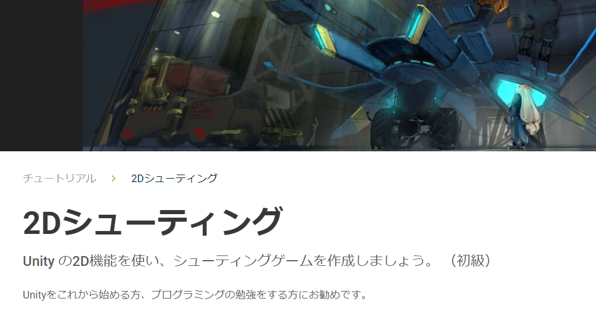

<!-- $theme: gaia -->

# Unity入学式 第2回
# & Unityもくもく会

---

## 本日の内容
- Unity入学式の説明
- 2Dシューティングチュートリアルをやる

---

# Unity入学式の説明

---

## Unity入学式の説明
- 毎月1回ずつ全部で4回か5回やります
- 2Dのシューティングゲームを作りながらUnityの基本的な仕組みを学びます
- 前回はスライドを使った講義形式で進めましたが、今回はもくもく会形式でやってみます
- 各自で資料を見ながら進めてください
- 質問があれば適宜周りにいるスタッフに質問してください
- Okinawa.unityのSlackがあるのでそちらで質問するのもOKです

---

## Slack

---

## 自習のススメ
- 1ヶ月に1回だけ勉強しても忘れがち
- 週に1回でもいいのでUnityを触ると忘れない

---

## おすすめ本
- 自分が気に入った本であればなんでもいい
- 100%理解できなくてもいいから本の中身を1回全部やる
- 終わったらもう1度やると前回より理解できる
- これから紹介する本は作りながら学ぶ（説明だけの箇所が少ない）ので飽きにくい

---

## おすすめ本
- 10日で学ぶUnity 5　2Dゲーム入門　カジュアルゲーム制作で楽しく覚えよう！
- 著者：株式会社フーモア Unity部
- ¥2,592

---

## おすすめ本
- 作って学ぶ　Unityゲーム開発の教科書　【Unity 5対応】
- 著者：森 信虎、さいたまげーむす
- ¥3,229

---

## もくもく会
- みんなで集まって各自もくもく勉強する会
- あちこちで開催されている
- スタートアップカフェコザ
	- 毎月第1日曜日にUnityもくもく会開催中

- 今回からもくもく会も同時開催します！

---

## LT大会
- 1人5分くらいの短い時間でプレゼンする（ライトニングトーク, LT）勉強会
- 勉強した事をLT大会で発表する
- Okinawa.unityでもLT大会やりました
	- 希望があればちょいちょいやります 
- 宜野湾エンジニア勉強会
	- 毎月LT大会を行っている

---

## 電源・Wifi付きカフェ(コワーキングスペース)
- スタートアップカフェコザ（沖縄市）（無料！）
- CODE BASE （宜野湾市）（無料！※平日のみ）
- スターバックス
- その他いろいろ

---

# 2Dシューティングチュートリアルをやる

---

## 2Dシューティングチュートリアル
- Unityが提供しているチュートリアル
- https://unity3d.com/jp/learn/tutorials/projects/2d-shooting-game-jp

---

## 2Dシューティングチュートリアル
- こんな感じのゲームを作りながらUnityの使い方を学びます
